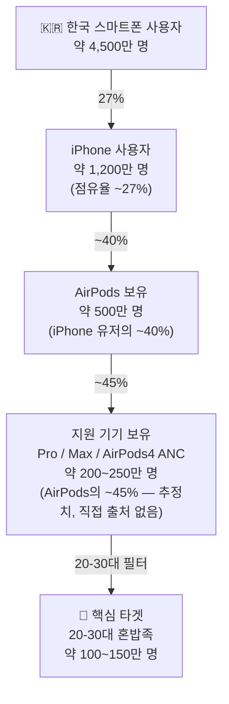
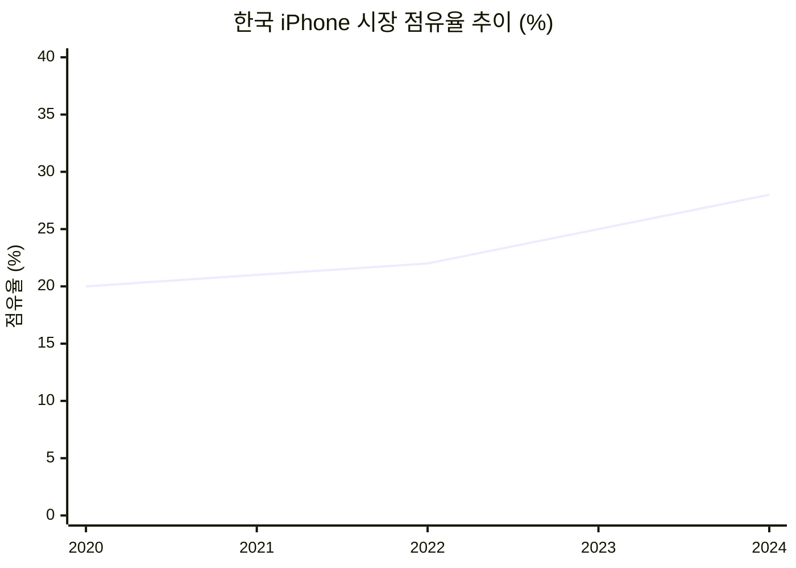
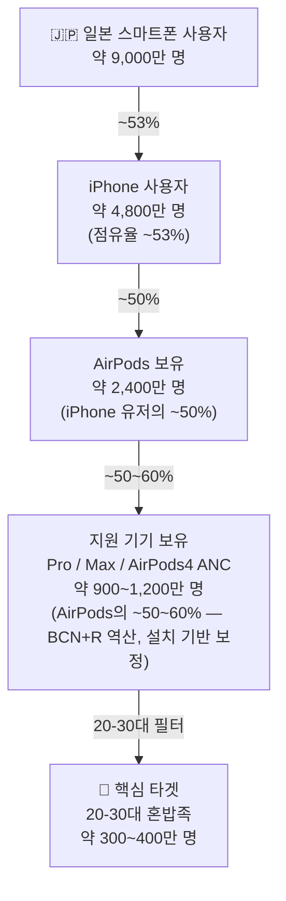

# 시장 규모 리서치 — 한국 · 일본

> AirPods IMU 지원 기기 보유 유저 기준 TAM 추정 (2024-2025 데이터)  
> 작성일: 2026-05-17

---

## 핵심 전제: 지원 기기 범위

`CMHeadphoneMotionManager` 가 동작하는 기기만 오도독의 핵심 기능을 사용할 수 있다.

| 기기 | 지원 |
|------|------|
| AirPods Pro 1세대 | ✅ |
| AirPods Pro 2세대 | ✅ |
| AirPods Max | ✅ |
| AirPods 4 (ANC 모델) | ✅ |
| AirPods 3세대 | ❌ |
| AirPods 2세대 | ❌ |
| AirPods 4 (기본 모델) | ❌ |

---

## 한국

### 주요 수치 (2024 기준)

| 지표 | 수치 | 출처 |
|------|------|------|
| 스마트폰 사용자 | 약 4,500만 명 | IDC 2024 |
| 연간 스마트폰 출하량 | 1,253만 대 | IDC Korea |
| **iPhone 시장 점유율** | **25~30%** | Counterpoint / Korea Herald |
| 20대 iPhone 비율 | **45%+** | Counterpoint 2023 |
| 추정 iPhone 사용자 | 약 1,100~1,350만 명 | 역산 |

### 깔때기 (전체 → 지원 기기 사용자)

### 성장 트렌드

- 매년 1~3%p씩 상승 중
- 20대에서 특히 빠른 전환 (Galaxy → iPhone)

---

## 일본

### 주요 수치 (2024 기준)

| 지표 | 수치 | 출처 |
|------|------|------|
| 스마트폰 사용자 | 약 9,000만 명 | 추정 |
| **iPhone 시장 점유율** | **50~60%** | MacDailyNews, Statcounter |
| 추정 iPhone 사용자 | 약 4,500~5,400만 명 | 역산 |
| AirPods 시장 (TWS 내) | Apple 점유율 **44.9%** (2021 BCN) | BCN+R |
| AirPods Pro 시리즈 비중 | **37.1%** (TWS 전체 판매량 대비, 2021) | BCN+R |

> 일본은 **글로벌 최대 iPhone 시장** 중 하나. 미국과 함께 iOS 점유율 50%+ 국가.

> ⚠️ **BCN+R 수치 해석 주의**: 37.1%는 AirPods Pro의 *전체 TWS 시장* 점유율.  
> AirPods Pro ÷ AirPods 전체 = 37.1% ÷ 44.9% ≈ **83%** (2021년 7월 판매량 스냅샷 기준).  
> 단, 이는 신규 판매 비율이며 누적 설치 기반(installed base)은 더 낮음 →  
> 구형 AirPods 보유자 포함 감안해 **지원 기기 비율 50~60%**로 보수적 추정.

### 깔때기 (전체 → 지원 기기 사용자)

---

## 한국 + 일본 통합

### 수치 비교

```mermaid
xychart-beta
    title "지원 기기 보유 사용자 추정 (만 명)"
    x-axis ["전체 스마트폰", "iPhone", "AirPods 보유", "지원 기기", "핵심 타겟(20-30대)"]
    y-axis "사용자 수 (만 명)" 0 --> 15000
    bar [4500, 1200, 500, 225, 125]
    bar [9000, 4800, 2400, 1050, 350]
```

> 파란색: 한국 / 주황색: 일본

### 합산 TAM

| 구분 | 한국 | 일본 | **합계** |
|------|------|------|---------|
| 지원 기기 보유 사용자 (전연령) | 200~250만 | 900~1,200만 | **1,100~1,450만** |
| 핵심 타겟 (20-30대 혼밥족) | 100~150만 | 300~400만 | **400~550만** |

---

## 해석

### 긍정적

- 일본이 한국보다 **약 3~4배 큰 시장** — 글로벌 확장 시 일본 우선 공략 합리적
- 두 나라 모두 iPhone 점유율 **상승 트렌드** — TAM이 매년 커지는 구조
- 일본은 AirPods Pro 시리즈 선호도가 글로벌 최고 수준 (프리미엄 시장)
- 한국 20대 iPhone 전환율 가속화 중 → 2~3년 내 한국 TAM도 빠르게 성장

### 제한 요소

- AirPods 3세대 / AirPods 4 기본 보유자는 핵심 기능 사용 불가 → 온보딩 시 지원 기기 안내 필수
- 식사 중 AirPods 착용 습관이 없으면 전환 필요 (행동 변화 요구)
- 일본 앱 스토어 출시 시 일본어 현지화 + 개인정보 정책 일본어 버전 필요

### 결론

> 한·일 합산 핵심 타겟 **400~550만 명**은 소마 MVP → 초기 스케일업 단계에서 충분히 의미 있는 시장.  
> 특히 일본은 iPhone 점유율과 프리미엄 AirPods 선호도가 높아 **한국 검증 후 일본 진출**이 자연스러운 경로.

---

## 데이터 출처

- [Korea Herald — Apple's market share exceeds 25% for first time in Korea](https://www.koreaherald.com/article/3322747)
- [Counterpoint — 국내 스마트폰 점유율 분기별 데이터](https://korea.counterpointresearch.com/%EA%B5%AD%EB%82%B4-%EC%8A%A4%EB%A7%88%ED%8A%B8%ED%8F%B0-%EC%A0%90%EC%9C%A0%EC%9C%A8-%EB%B6%84%EA%B8%B0%EB%B3%84-%EB%8D%B0%EC%9D%B4%ED%84%B0/)
- [IDC — 2024년 국내 스마트폰 시장](https://my.idc.com/getdoc.jsp?containerId=prAP53253025)
- [MacDailyNews — Apple iPhone takes 51.9% share of Japan](https://macdailynews.com/2024/03/05/apple-iphone-takes-51-9-share-of-japans-smartphone-market/)
- [BCN+R — 완전 무선이어폰 일본 시장 점유율](https://www.bcnretail.com/market/detail/20210826_241118.html)
- [Counterpoint — 2024 TWS 무선이어폰 시장](https://korea.counterpointresearch.com/2024-tws-market-sales/)
- [Apple Insider — iPhone market share growing in Korea thanks to youth](https://appleinsider.com/articles/23/07/24/samsungs-galaxy-is-about-to-have-a-generational-iphone-problem-in-south-korea)
