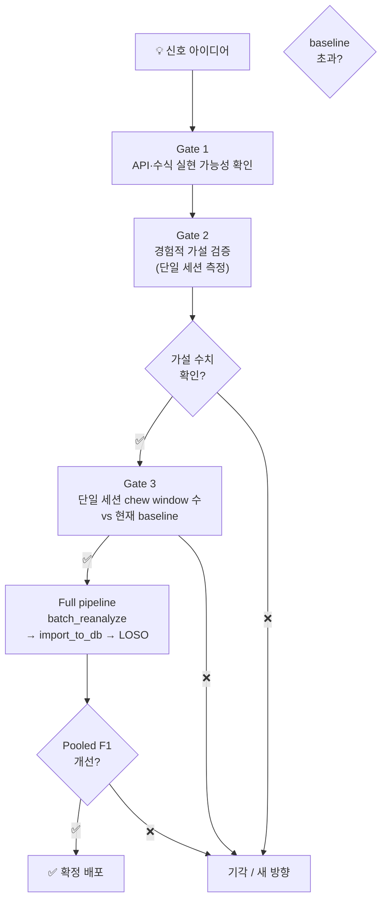
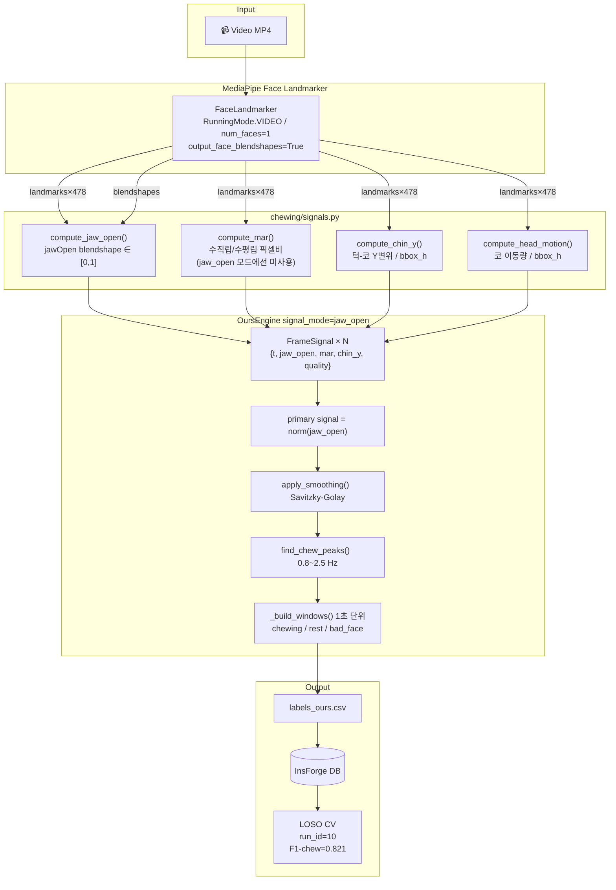

# chewing-vision 기술 가이드

> 팀원을 위한 실행 가이드. 기본 구조(데이터 흐름, 파일 스키마)는 `ml/PIPELINE_OVERVIEW.md`를 먼저 읽을 것.  
> 이 문서는 **vision 신호 파이프라인**과 **현재 실험 현황**에 집중한다.

---

## 목차

1. [Vision 신호 파이프라인](#1-vision-신호-파이프라인)
2. [주요 파라미터](#2-주요-파라미터)
3. [도구별 실행 방법](#3-도구별-실행-방법)
4. [현재 성능 수치 (LOSO)](#4-현재-성능-수치-loso)
5. [신호 선택 실험 이력](#5-신호-선택-실험-이력)
6. [미결 사항](#6-미결-사항)

---

## 1. Vision 신호 파이프라인

### 왜 신호가 두 개인가

MediaPipe는 얼굴에서 두 가지 다른 성격의 데이터를 뽑아준다.

| 신호 | 출처 | 특성 |
|------|------|------|
| **MAR** (Mouth Aspect Ratio) | 랜드마크 좌표로 직접 계산 | 기하학적 측정. 미세 씹기에 민감하지만 고개 움직임에도 반응 |
| **jaw_open** | MediaPipe 블렌드쉐이프 | 신경망 출력. 머리 자세 보정이 내장되어 있지만 미세 씹기를 놓치는 경향 |

```
MAR    = (위 입술 ~ 아래 입술 거리) / (입 좌우 너비)
           → 픽셀 비율이라 얼굴 크기 무관
           
jaw_open = MediaPipe가 "턱이 얼마나 열렸나"를 0~1로 추정한 값
           → 고개를 돌려도 상대적으로 안정적
```

### 세 가지 signal_mode

`OursEngine`은 `signal_mode` 파라미터로 어떤 신호를 기준으로 씹기를 감지할지 선택한다.

```
"jaw_open"  → jaw_open 신호만 사용
"mar"       → MAR 신호만 사용
"composite" → mar_weight × norm(MAR) + (1 - mar_weight) × norm(jaw_open)
```

**composite**는 두 신호를 정규화해서 섞는다. `mar_weight=0.7`이면 MAR이 70%, jaw_open이 30%.

### motion gate — 고개 움직임 억제

composite/mar 모드에서만 적용되는 게이트. 프레임 간 코 위치 변화가 얼굴 높이의 3% 이상이면 해당 프레임의 신호를 약화시킨다.

```python
gate = _motion_gate(frames, threshold=0.03)
# 코 변위 / 얼굴 bbox 높이 > 0.03 → 신호 감쇠
```

고개를 크게 끄덕이거나 돌릴 때 발생하는 false positive를 줄이기 위한 장치다.

### 전체 흐름

```
영상 프레임
    │ MediaPipe
    ▼
MAR, jaw_open (raw, 30fps)
    │ Savitzky-Golay 스무딩
    ▼
smoothed 신호
    │ motion gate (composite/mar에만)
    ▼
primary signal 선택 (signal_mode에 따라)
    │ peak detection (0.8~2.5 Hz 범위)
    ▼
1초 윈도우 라벨링
  chewing event ≥ 1 → "chewing"
  chewing event = 0 → "rest"
  face quality < 0.5 → "bad_face"
    │
    ▼
labels_ours.csv (GT 라벨)
```

---

## 2. 주요 파라미터

| 파라미터 | 위치 | 현재값 | 의미 |
|---------|------|--------|------|
| `signal_mode` | `OursEngine.__init__` | `"jaw_open"` | 씹기 감지 신호 선택 |
| `mar_weight` | `OursEngine.__init__` | 미사용 | composite에서 MAR 비중 (현재 jaw_open 모드) |
| `WINDOW_SEC` | `ours.py:48` | `1.0` | GT 라벨 1개의 길이 (초) |
| motion gate threshold | `_motion_gate()` | `0.03` | 코 변위 / 얼굴 높이. 이 이상이면 신호 감쇠 |
| LOSO window_sec | `compare_sessions.py` | `2.0` | IMU 피처 추출 윈도우 |
| LOSO stride | `compare_sessions.py` | `0.5` | IMU 슬라이딩 윈도우 stride |

### 현재 확정 설정

```python
# ml/batch_reanalyze.py
ENGINE = OursEngine(signal_mode="jaw_open")
```

`labels_ours.csv`는 현재 jaw_open 모드로 재분석된 상태 (LOSO run_id=10).  
아래 §신호 선택 실험 이력에서 이 결론에 도달한 과정을 확인할 수 있다.

---

## 3. 도구별 실행 방법

> 모든 명령은 `chewing-vision/` 루트에서 실행.

### GT 라벨 재생성 (batch_reanalyze.py)

모든 세션의 `labels_ours.csv`를 재생성할 때 사용.

```bash
python ml/batch_reanalyze.py
```

출력: 각 세션 폴더의 `labels_ours.csv` 덮어쓰기

---

### 두 신호 비교 (compare_signals.py)

jaw_open vs composite를 한 세션에서 나란히 비교.

```bash
python ml/compare_signals.py sessions/20260515T125354_v1kr2w --mar-weight 0.3

# 출력: 씹기 횟수, 분당 횟수, chew 비율 비교표 + 비교 영상
```

```
Metric                    jaw_open   composite(w=0.3)
n_chews                        48             56
chews_per_min                27.9           32.5
chew_pct (%)                 38.5           45.2
```

---

### 불일치 구간 수동 라벨링 (annotate.py)

jaw_open과 composite가 다르게 판정한 윈도우만 뽑아서 직접 라벨링.  
어떤 엔진이 더 정확한지 검증하는 도구.

```bash
# 불일치 윈도우만 라벨링 (권장)
python ml/annotate.py sessions/20260515T125354_v1kr2w

# 모든 윈도우 라벨링
python ml/annotate.py sessions/20260515T125354_v1kr2w --all
```

키 조작:

| 키 | 동작 |
|----|------|
| `c` | chewing 라벨 부여 + 다음으로 이동 |
| `r` | rest 라벨 부여 + 다음으로 이동 |
| `b` | bad_face 라벨 부여 + 다음으로 이동 |
| `a` / `d` | 이전 / 다음 윈도우 (라벨 없이 이동) |
| `s` | 중간 저장 |
| `q` | 저장 후 종료 + 정확도 리포트 출력 |

종료 후 자동으로 정확도 비교 리포트가 출력된다:
```
jaw_open  matches human GT : X/N  (XX%)
composite matches human GT : X/N  (XX%)
```

> **BLIND 모드**: 라벨링 중 엔진 판정이 화면에 표시되지 않는다. 의도적인 설계 —  
> 영상만 보고 판단해야 엔진에 끌려가지 않는 공정한 비교가 된다.

---

### LOSO 교차 검증 (compare_sessions.py)

세션 하나씩 빼고 나머지로 학습 → 뺀 세션으로 예측.  
IMU 피처 → vision GT 라벨의 정렬 정도를 측정.

```bash
python ml/compare_sessions.py -o ml/outputs/loso_결과폴더/

# HTML 리포트 열기
open ml/outputs/loso_결과폴더/session_comparison.html
```

> **LOSO가 측정하는 것**: "vision 라벨이 얼마나 정확한가"가 아니라  
> "IMU 신호가 vision 라벨과 얼마나 잘 매핑되는가".  
> vision 라벨이 더 세밀해져도 IMU가 그 차이를 감지 못하면 LOSO가 내려갈 수 있다.

---

### 단일 세션 분석

```bash
python -m chewing.cli analyze \
  sessions/20260515T125354_v1kr2w/video_20260515T125354_v1kr2w.mp4 \
  -o /tmp/chewing_v1kr2w
```

---

## 4. 현재 성능 수치 (LOSO)

**7개 세션, LOSO 교차 검증 기준** — run_id=10, signal_mode=jaw_open (2026-05-17)

| 세션 (held out) | acc | F1-chew | F1-rest | 비고 |
|----------------|-----|---------|---------|------|
| hz0mma | 0.950 | **0.972** | 0.788 | |
| 838cje | 0.868 | 0.926 | 0.400 | |
| a61a4c | 0.693 | 0.800 | 0.340 | |
| uj2e92 | 0.710 | 0.800 | 0.474 | |
| n1xetu | 0.799 | 0.760 | 0.827 | |
| v1kr2w | 0.860 | 0.588 | 0.916 | |
| j2b3jd | 0.618 | 0.490 | 0.695 | 비스듬 각도 세션, yaw 중앙값 23.6° |
| **Pooled** | **0.781** | **0.821** | **0.719** | |

### 실험별 비교

| run_id | signal_mode | Pooled F1-chew | 비고 |
|--------|-------------|----------------|------|
| 9 | composite (mar_weight=0.3) | 0.788 | 7세션 |
| — | yaw-corrected MAR (단일 테스트) | — | j2b3jd: 49/187 ❌ |
| **10** | **jaw_open** | **0.821** | 7세션, 현재 기준 |

---

## 5. 신호 선택 실험 이력

### 결론

MAR은 어떤 가중치·보정 방식에서도 jaw_open만 쓰는 것보다 나쁘거나 같았다.  
**현재 확정: `signal_mode="jaw_open"`.**

### 검증 게이트 프로토콜

비용이 큰 실험(full LOSO)을 낭비하지 않기 위해 단계적으로 검증한다.



### 실험 기록

#### composite 모드 (mar_weight=0.3)
- **설정**: `primary = 0.3 × norm(MAR) + 0.7 × norm(jaw_open)`
- **LOSO run_id=9**: Pooled F1-chew=0.788, acc=0.757 (7세션)
- **문제**: 비스듬 세션 j2b3jd에서 composite 53/187 vs jaw_only 63/187 → MAR이 net-negative

#### yaw 보정 MAR (cos-yaw correction)
- **가설**: 카메라 yaw 회전 시 가로 입술 거리가 foreshortening → MAR 분모 불안정
- **Gate 2 결과**: j2b3jd 첫 300프레임, 중앙값 |yaw|=23.6°, 83% 프레임이 >20° ✅
- **구현**: `corrected_MAR = observed_MAR × cos(yaw)`, |yaw|>45° 시 jaw_open fallback
  - `chewing/signals.py` — `compute_mar_yaw_corrected()` 추가 (보존됨)
- **Gate 3 결과**: j2b3jd **49/187** ← baseline 63 미달 ❌
  - cos(yaw) 보정이 per-frame variance를 오히려 증가. trig만으론 landmark noise 미해결
- **결론**: 기각. ours.py 변경 롤백

#### jaw_open only
- **LOSO run_id=10**: Pooled F1-chew=**0.821**, acc=**0.781** (7세션)
- **j2b3jd 개선**: F1-chew 0.372 → 0.490
- **확정 채택**

### 현재 시스템 구조



---

## 6. 미결 사항

### 세션 수집 목표

- 현재: 7개 유효 세션
- 목표: 20개 이상
- 세션당 2~3분, 음식 종류·시간대·고개 각도 다양하게
- chewing 비율 50% 근처 유지 (의도적으로 쉬는 구간 포함)

### j2b3jd 세션 F1-chew 낮음 (0.490)

비스듬한 각도(중앙값 yaw=-23.6°) 세션. yaw 보정 MAR을 시도했으나 개선 없음 (§신호 선택 실험 이력 참고).  
추가 접근 옵션:
- 비스듬 각도 세션을 더 수집해서 모델이 다양한 자세에 노출되게 하기
- 고개 각도 정규화 전처리 (카메라 정면 권장 가이드 추가)
